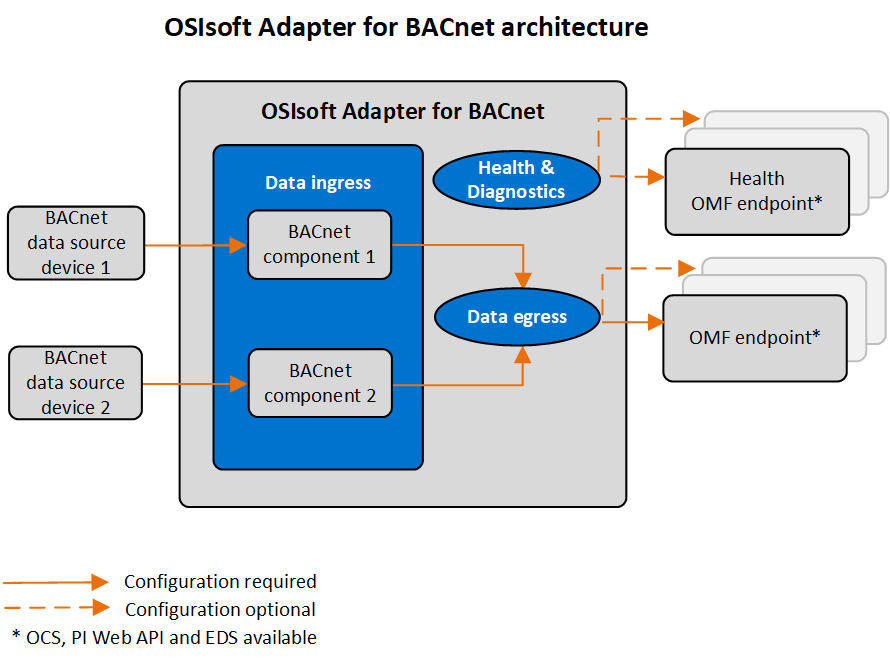

# PI Adapter for BACnet overview

The PI Adapter for BACnet (Building Automation and Control Networks) is a data-collection component that transfers time-series data from source devices to OMF endpoints in OSIsoft Cloud Services or PI Servers. BACnet is a communication protocol that is developed and maintained by ASHRAE. The adapter adheres to ANSI/ASHRAE Standard 135-2012 and communicates with any device using BACnet/IP, and devices that conform to other BACnet protocols using a BACnet gateway or router.

The adapter is installed with a download kit obtained from the OSIsoft Customer Portal and works on devices running either Windows or Linux operating systems.

All functions of the adapter are configured using REST API. The configurations are stored in JSON files. For data ingress, an adapter component must be defined in the system components configuration for each data source to which the adapter will connect. Each adapter component is then configured with the connection information for the data source and the data to collect. For data egress, configuration is needed to specify destinations for the data, including security for the outgoing connection. Additional configurations are available to egress health and diagnostics data, add buffering configuration to protect against data loss, and record logging information for troubleshooting purposes.

Once the adapter is configured and sending data, administration functions are used to manage the adapter or individual ingress components of the adapter. Health and diagnostics functions monitor the status of connected devices, adapter system functions, the number of active data streams, the rate of data ingress, the rate of errors, and the rate of data egress.

The EdgeCmd utility is an OSIsoft proprietary command line tool that is used to configure and administer an adapter on both Linux and Windows operating systems. It is installed separately from the adapter.

<!--
# PI Adapter for BACnet

=======

- [PI Adapter for BACnet overview](xref:PIAdapterforBACnetOverview)
  - [PI Adapter for BACnet supported features](xref:PIAdapterforBACnetSupportedFeatures)
  - [PI Adapter for BACnet principles of operation](xref:PIAdapterforBACnetPrinciplesOfOperation)
- [Installation](xref:Installation)
  - [Install the adapter](xref:InstallTheAdapter)
  - [Install PI Adapter for BACnet using Docker](xref:InstallPIAdapterForBACnetUsingDocker)
  - [Uninstall the adapter](xref:UninstallTheAdapter)
- [Configuration](xref:BACnetConfiguration)
  - [Configuration tools](xref:ConfigurationTools)
  - [System components configuration](xref:SystemComponentsConfiguration)
  - [PI Adapter for BACnet data source configuration](xref:PIAdapterforBACnetDataSourceConfiguration)
  - [PI Adapter for BACnet data selection configuration](xref:PIAdapterforBACnetDataSelectionConfiguration)
  - [PI Adapter for BACnet security configuration](xref:PIAdapterforBACnetSecurityConfiguration)
  - [Egress endpoints configuration](xref:EgressEndpointsConfiguration)
  - [Health endpoint configuration](xref:HealthEndpointConfiguration)
  - [Diagnostics configuration](xref:DiagnosticsConfiguration)
  - [Buffering configuration](xref:BufferingConfiguration)
  - [Logging configuration](xref:LoggingConfiguration)
  - [System and adapter configuration](xref:SystemAndAdapterConfiguration)
- [Administration](xref:Administration)
  - [Start and stop an adapter](xref:StartAndStopAnAdapter)
  - [Start and stop ingress component](xref:StartAndStopIngressComponent)
  - [Retrieve product version information](xref:RetrieveProductVersionInformation)
  - [Delete an adapter component](xref:DeleteAnAdapterComponent)
- [Health and diagnostics](xref:HealthAndDiagnosticsForBACnet)
  - [Adapter health](xref:AdapterHealthForBACnet)
    - [Device status](xref:DeviceStatusForBACnet)
    - [Next health message expected](xref:NextHealthMessageExpectedForBACnet)
  - [Adapter diagnostics](xref:AdapterDiagnostics)
    - [System](xref:System)
    - [Stream count](xref:StreamCount)
    - [IO rate](xref:IORate)
    - [Error rate](xref:ErrorRate)
  - [Egress diagnostics](xref:EgressDiagnostics)
-->
